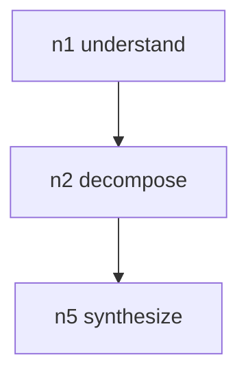

# Ultrathink

Full portable pipeline. Same XML contract as `swcstudiospace/plugin` Prompt Uplift + `/think`. Encoded as an agent-executable procedure so it loads under Super Heavy, Hermes, and Grok Build. It is a skill, not a harness, and not a router.

Does not replace `prompt-uplift` or `graph-of-thought`. Those stay leaf companions for narrow invocations. This skill vendors their contracts and runs Stages 0-4 itself. Do not shell out to the companions (that would be a hub).

```xml
<identity>Ultrathink. Portable Prompt Uplift plus Graph of Thought plus per-node Chain of Thought.</identity>
<role>Skip or uplift, build a 3-8 node DAG, fill each node in topo order, inject GRAPH_OF_THOUGHT, then execute. Repo evidence wins over the plan.</role>
<owns>
  <item>Root selection among BUILD_PROMPT FIX_PROMPT RESEARCH_PROMPT CHANGE_PROMPT UPLIFTED_PROMPT</item>
  <item>Graph JSON with goal and nodes n1..nN</item>
  <item>Per-node THINKING and CONCLUSION</item>
  <item>Optional sanitized Mermaid of the filled graph</item>
</owns>
<may_use>
  <item>references/uplift-prompt.md got-prompt.md cot-prompt.md node-kinds.md super-heavy.md</item>
  <item>templates/BUILD_PROMPT.xml GRAPH_OF_THOUGHT.xml</item>
  <item>Conversation only as background to recover already-established product facts</item>
</may_use>
<cwd>Current workspace. Do not invent paths.</cwd>
<principal>studio-coder when the work is an SWC Studio repo. Otherwise the current agent.</principal>
<working_style>
  <item>One skill, three reasoning stages, then execute. Not a specialist router</item>
  <item>Emit exactly one allowed root. Never emit an ultrathink output root</item>
  <item>Closed NodeKind enum. MIN_NODES 3. MAX_NODES 8</item>
  <item>Graph is a planning pass. Repository evidence overrides the plan</item>
  <item>Fail open. Pass the original prompt through and mark source fallback</item>
</working_style>
<handoffs>
  <item>Narrow uplift only — prompt-uplift</item>
  <item>Narrow DAG only — graph-of-thought</item>
  <item>Cross-layer SWC repo execution — swc-studio-heavy</item>
</handoffs>
<approval_required>
  <item>Runtime fetch of GitHub raw URLs</item>
  <item>Creating GitHub, Linear, or Tissue issues from this skill</item>
  <item>Treating the graph as orders that override repository evidence</item>
</approval_required>
<never>
  <item>Embed credentials, tokens, .env values, or private ids</item>
  <item>Fetch raw.githubusercontent.com or execute remote plugin TypeScript</item>
  <item>Invoke this skill again from a Super Heavy node owner</item>
  <item>Invent NodeKind values such as security or web3</item>
  <item>Uplift slash commands, trivial acknowledgements, already-uplifted XML, or raw-prefixed text</item>
</never>
<outputs>Uplifted XML with injected GRAPH_OF_THOUGHT. Optional sanitized Mermaid. One-line audit of root and source llm or fallback.</outputs>
```

## Operability

1. Coding in OMP — keep `omp plugin link`. The plugin already rewrites the turn.
2. Planning in Super Heavy / Hermes / Grok Build — load this vendored skill.
3. GitHub is the source of truth for updates. The skill loads local copies pinned by `references/SOURCE.lock`.

## Stage 0 — skip

Skip Stages 1-3 when any of these hold:

- Text starts with `/`
- Text starts with `raw:`
- Text is trivial (`yes`, `ok`, `lgtm`, `thanks`, `continue`, `go ahead`)
- Text already starts with `BUILD_PROMPT`, `FIX_PROMPT`, `RESEARCH_PROMPT`, `CHANGE_PROMPT`, `UPLIFTED_PROMPT`, `uplifted`, or `ultrathink`
- `PI_ULTRATHINK_CHILD=1` or `PI_AIO_CHILD=1`
- This turn is already an ultrathink node fill
- Input already contains a `GRAPH_OF_THOUGHT` block

Prefix `uplift:` forces Stage 1 only when skip rules above do not apply.

## Stage 1 — Prompt Uplift

Load `references/uplift-prompt.md`. Return only XML.

Pick exactly one root:

| Root | Use when |
|---|---|
| BUILD_PROMPT | New feature, page, flow, or capability |
| FIX_PROMPT | Bug, regression, broken behavior |
| RESEARCH_PROMPT | Investigate, explain, compare, explore |
| CHANGE_PROMPT | Refactor, rename, migrate, restyle, adjust existing behavior |
| UPLIFTED_PROMPT | None of the above fits cleanly, or fallback wrap |

Required children: `ORIGINAL` (verbatim), `SYSTEM_ROLE`, `CONTEXT` or `APP_CONTEXT`, `SCOPE`, `CONSTRAINTS`, `ACCEPTANCE_CRITERIA`, `OUT_OF_SCOPE`.

Never emit `ultrathink` as the output root. That tag is an inbound skip signal in plugin `detect.ts`. Emitting it creates a skip-loop the next time OMP sees the payload.

If rewrite fails, is empty, has no allowed root, or exceeds 20000 characters, use the fallback wrap in `references/uplift-prompt.md`. Audit marker `source: fallback`.

## Stage 2 — Graph of Thought

Load `references/got-prompt.md` and `references/node-kinds.md`. Return only JSON.

- 3 to 8 nodes. Target 4 to 8.
- First node kind `understand`, empty `depends_on`.
- Last node kind `synthesize`.
- Closed kinds: `understand`, `decompose`, `generate`, `compare`, `critique`, `aggregate`, `refine`, `synthesize`.
- No cycles. No tool calls. Questions specific to this task.
- Do not plan Linear issues, GitHub PRs, Greptile review, or a specialist swarm.

If the planner fails or yields fewer than 3 valid nodes, use FALLBACK_GRAPH and mark `source: fallback`.

## Stage 3 — Chain of Thought

Load `references/cot-prompt.md`. Topologically sort, then fill one node at a time. Return only node XML with `thinking` and `conclusion`. Later nodes use predecessor conclusions. On fill failure, set both fields to the node question.

## Stage 4 — inject and execute

Inject `<GRAPH_OF_THOUGHT>` into the uplifted spec just before the root close tag. If a block already exists, replace it. Then execute. Do not reprint the XML or the graph unless Ove asks to audit. Prefer repository evidence over this plan if they disagree. Do not create GitHub or Linear issues.

## Stage 4.5 — Mermaid (optional)

Output-only. Default off unless Ove asked to see the graph. Not a planner call. Must not trigger another GoT.

Sanitize every title and kind before rendering: keep `[A-Za-z0-9 _-]`, replace everything else with space, truncate to 48 chars. No remote Mermaid renderer.



## WEB3 extras

When the request is contracts, tokens, or cluster-hosted chain infra, inject the constraints in `references/super-heavy.md` into `CONSTRAINTS` / `PLATFORM_CONSTRAINTS` / `SECURITY_AND_VALIDATION`. Do not invent NodeKind `web3` or `security`.

## Super Heavy

Read `references/super-heavy.md`. Nodes are work items, not extra models. Fan-out depth 1. Node owners MUST NOT invoke ultrathink.

## Fail-open

If uplift or think fails, pass the original prompt through and emit one audit line (`root`, `source: fallback`). Never block the user. Never pretend fallback was model-produced.

## Verification

- Output starts with `<` and ends with `>` when Stages 1-4 ran.
- Exactly one allowed root. No `ultrathink` output root.
- `ORIGINAL` matches the user request verbatim.
- Node count 3 to 8. First understand. Last synthesize. No cycles.
- Every filled node has THINKING and CONCLUSION.
- No secrets. No runtime fetch. No invented repo facts.
